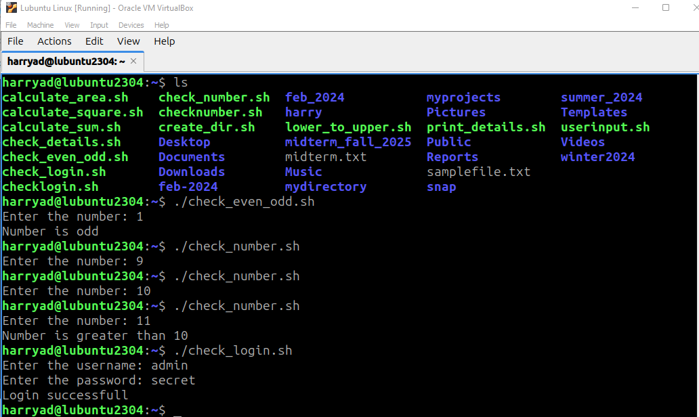

# Lab11_linux
Lab 11: Execute shell scripts

[check_even_odd.sh](https://github.com/hjoseph777/Lab11_linux/blob/e44e0189dac3d9f560256253eb6ed0b014553c0b/check_even_odd.sh)
The check_even_odd.sh script prompts the user to enter a number and checks if the number is even or odd.

[check_login.sh](https://github.com/hjoseph777/Lab11_linux/blob/e44e0189dac3d9f560256253eb6ed0b014553c0b/check_login.sh)
The check_login.sh script prompts the user to enter a username and password, and validates them against predefined values.

[check_number.sh](https://github.com/hjoseph777/Lab11_linux/blob/e44e0189dac3d9f560256253eb6ed0b014553c0b/check_number.sh)
The check_number.sh script checks if a given number is greater than 10.

